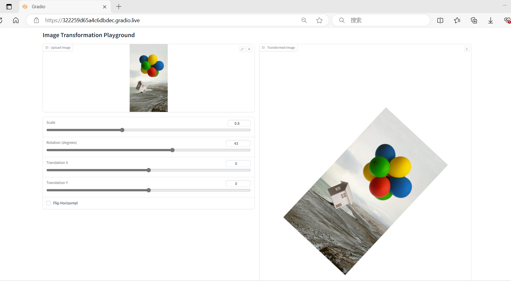
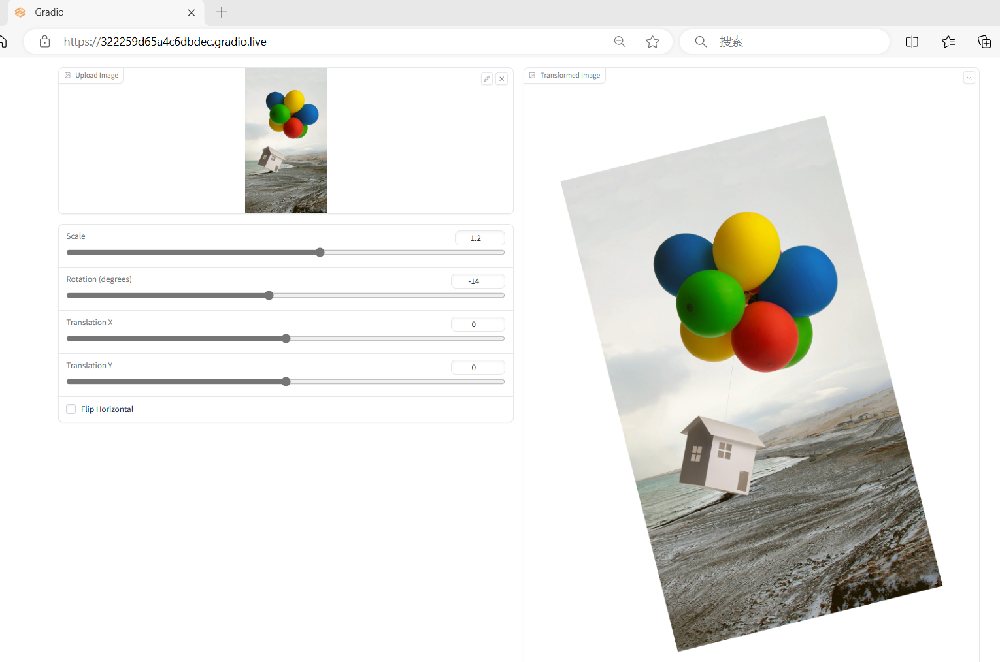
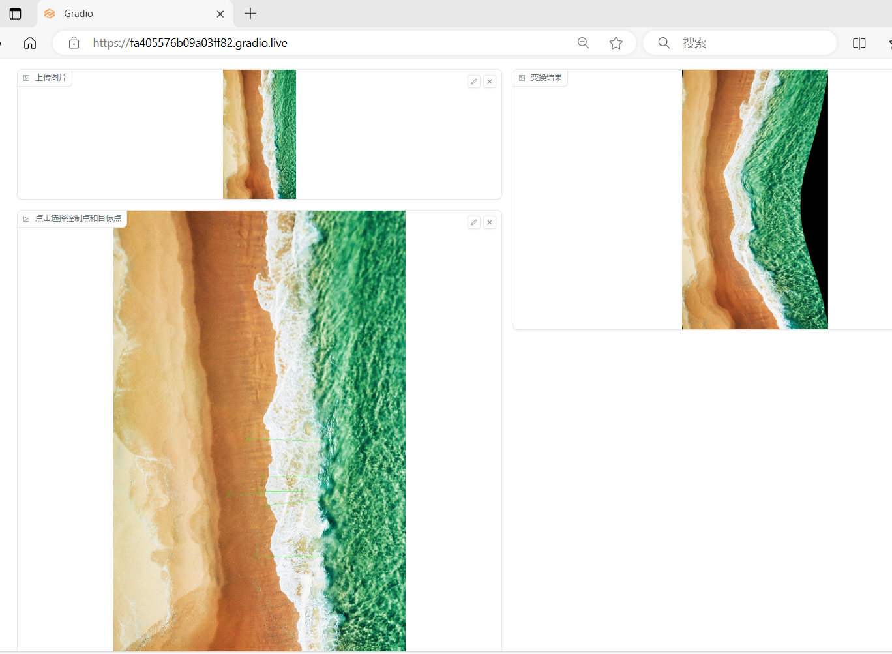

# Lab_02 repo  https://github.com/ParanoidAndroid-678/DIP-Assignment

# Implementation of Image Geometric Transformation
This repository is Zezhou Zhou's implementation of Assignment_01 of DIP.

# requirements
To install requirements:
```
python -m pip install -r requirements.txt
```
# Running
To run basic transformation, run:
```
python global_transform.py
```
To run guided transformation, run:
```
python moving_least_squares.py
```
# Results
## BasicTransformation


## Point Guiged Deformation


